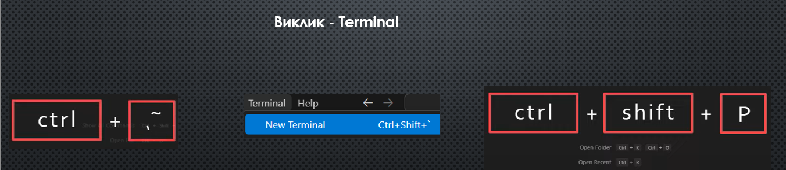

### Підтримка тегів:

https://caniuse.com

### Коректність коду: 

https://validator.w3.org

### Елементи:

https://developer.mozilla.org/en-US/docs/Web/HTML/Element

### Підтримка елементів:

https://www.w3schools.com/tags/ref_html_browsersupport.asp

### Застарілі теги:

https://www.geeksforgeeks.org/html-deprecated-tags/
https://html.com/html5/#Deprecated_Features_in_HTML5

### Спеціальні символи:

https://www.w3schools.com/html/html_entities.asp
https://www.toptal.com/designers/htmlarrows/
https://developer.mozilla.org/en-US/docs/Glossary/Character_reference

### Online (readme.md) редактор

https://pandao.github.io/editor.md/en.html

### Встановлення git

https://git-scm.com/downloads

## VS code відкриття Terminal

### Стиснення розмірів png

https://tinypng.com

### Перевірка html, css

https://caniuse.com

### Animations + gradients

https://webcode.tools/css-generator/keyframe-animation
https://animista.net/play/entrances/slide-in/slide-in-right
https://css-tricks.com/animate-svg-path-changes-in-css
https://developer.mozilla.org/en-US/docs/Web/SVG/Element/linearGradient
https://lottiefiles.com/free-animations/pack
