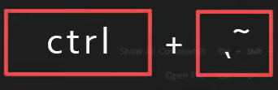
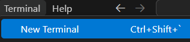
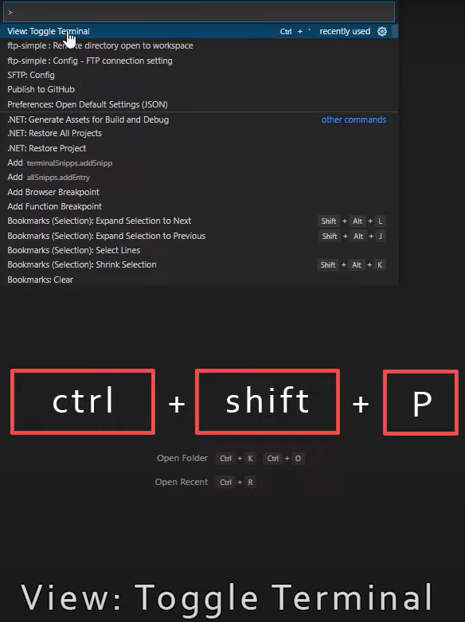

## Open terminal in VS Code

<figure style="text-align: center">
  
  <figcaption>ctrl+~</figcaption>
</figure>
     
    

<figure style="text-align: center">
  
  <figcaption>new terminal</figcaption>
</figure>
     
    

<figure style="text-align: center">
  
  <figcaption>ctrl+shift+p</figcaption>
</figure>
